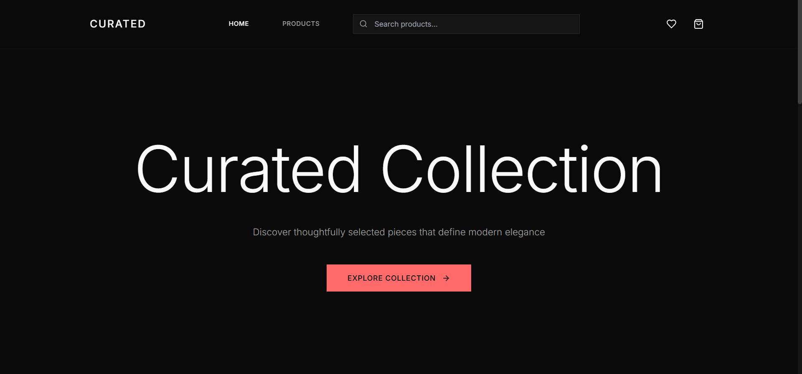
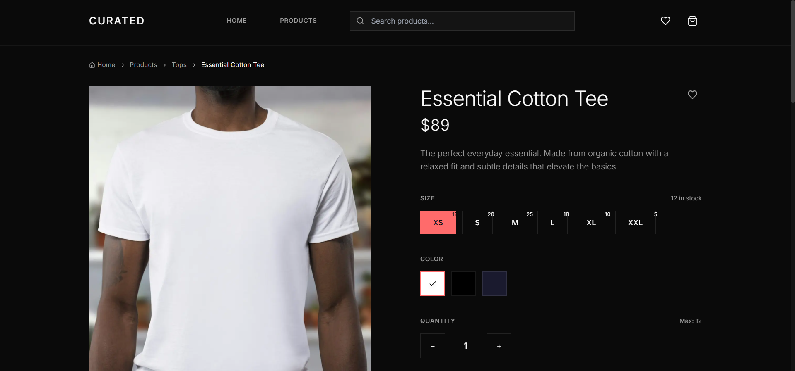
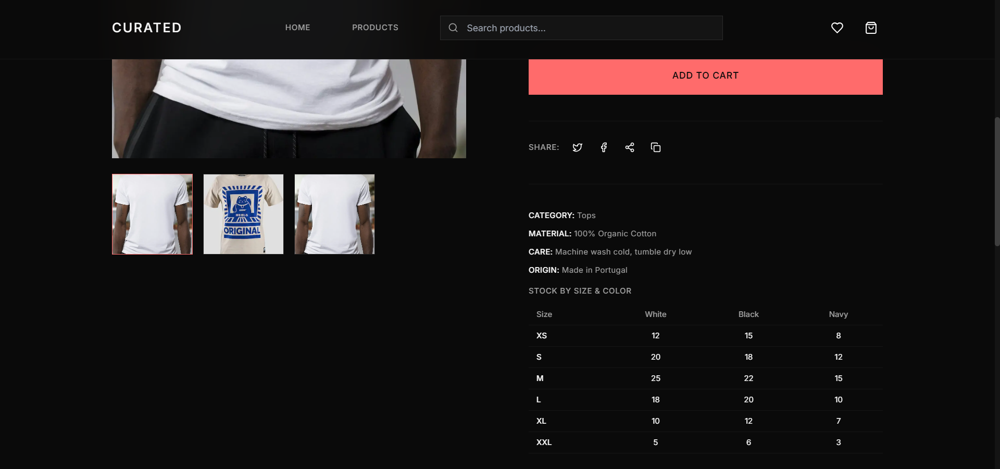
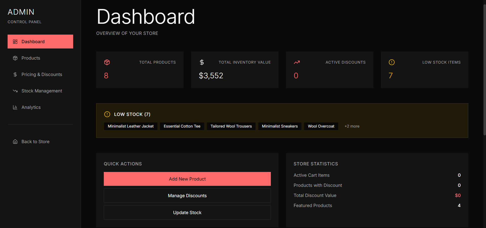

# Premium E-Commerce Platform

A modern, premium e-commerce web application built with Next.js 14, TypeScript, and Tailwind CSS. Features a sophisticated dark mode design inspired by luxury brands like Apple, SSENSE, and Aesop.


## 📸 Screenshots

### Homepage


### Products Page


### Product Detail


### Products Grid


### Admin Panel


## ✨ Features

### 🎨 Design & UX
- **Premium Dark Mode Design** - Minimalist aesthetic with refined typography and generous spacing
- **Responsive Layout** - Mobile-first design that works seamlessly across all devices
- **Smooth Animations** - Subtle, intentional micro-interactions using Framer Motion
- **Visual Hierarchy** - Clear typography scale and spacing system

### 🛍️ E-Commerce Features
- **Product Catalog** - Asymmetric grid layout with hover image swapping
- **Advanced Filtering** - Filter by category, price range, and color with price slider
- **Product Search** - Real-time search with autocomplete suggestions
- **Product Sorting** - Sort by price, name, and default order
- **Product Details** - Large imagery with animated size/color selectors, stock management
- **Image Zoom/Lightbox** - Fullscreen image viewer with keyboard navigation
- **Quick View Modal** - Quick product preview without leaving the page
- **Shopping Cart** - Slide-in drawer with real-time price calculation
- **Wishlist** - Save favorite products for later
- **Recently Viewed** - Track and display recently viewed products
- **Similar Products** - Product recommendations based on category
- **Social Share** - Share products on social media platforms
- **Checkout Flow** - Complete form validation with success screen
- **Quick Add** - Add products to cart directly from product cards
- **Stock Management** - Real-time stock tracking with low stock warnings
- **Breadcrumb Navigation** - Clear navigation hierarchy

### ⚡ Performance & SEO
- **Optimized Images** - Next.js Image component with proper sizing
- **Code Splitting** - Automatic route-based code splitting
- **Skeleton Loaders** - Enhanced perceived performance with detailed loading states
- **Type Safety** - Full TypeScript implementation with strict mode
- **SEO Optimized** - Metadata, Open Graph, Twitter Cards, Sitemap, Robots.txt
- **Error Handling** - Error boundaries and custom error pages
- **Accessibility** - ARIA labels, keyboard navigation, semantic HTML
- **Local Storage** - Persistent cart, wishlist, and recently viewed items

## 🚀 Tech Stack

- **Framework**: Next.js 14 (App Router)
- **Language**: TypeScript
- **Styling**: Tailwind CSS
- **Animations**: Framer Motion
- **Icons**: Lucide React
- **State Management**: React Context API
- **Build Tool**: Next.js built-in bundler

## 📦 Installation

1. Clone the repository:
```bash
git clone https://github.com/yourusername/premium-ecommerce.git
cd premium-ecommerce
```

2. Install dependencies:
```bash
npm install
```

3. Run the development server:
```bash
npm run dev
```

4. Open [http://localhost:3000](http://localhost:3000) in your browser.

## 📁 Project Structure

```
premium-ecommerce/
├── app/                          # Next.js App Router
│   ├── page.tsx                 # Landing page with hero section
│   ├── products/                # Products pages
│   │   ├── page.tsx            # Products listing with filters
│   │   ├── [slug]/             # Individual product pages
│   │   │   ├── page.tsx        # Product detail page
│   │   │   └── loading.tsx     # Loading state
│   │   └── loading.tsx         # Loading state
│   ├── checkout/                # Checkout flow
│   │   └── page.tsx            # Checkout form
│   ├── wishlist/               # Wishlist page
│   │   └── page.tsx            # Wishlist items
│   ├── layout.tsx              # Root layout with providers
│   ├── globals.css             # Global styles
│   ├── error.tsx               # Error boundary
│   ├── global-error.tsx        # Global error handler
│   ├── not-found.tsx           # 404 page
│   ├── sitemap.ts              # Dynamic sitemap
│   └── robots.ts               # Robots.txt
├── components/                  # Reusable UI components
│   ├── Navbar.tsx             # Navigation bar
│   ├── Footer.tsx             # Footer with newsletter
│   ├── ProductCard.tsx        # Product card with hover effects
│   ├── ProductCardWithQuickView.tsx  # Product card with quick view
│   ├── ProductGrid.tsx        # Grid layout component
│   ├── CartDrawer.tsx         # Shopping cart drawer
│   ├── QuickViewModal.tsx     # Quick view modal
│   ├── ImageLightbox.tsx      # Fullscreen image viewer
│   ├── WishlistButton.tsx     # Wishlist toggle button
│   ├── SearchBar.tsx          # Search with autocomplete
│   ├── Breadcrumb.tsx         # Breadcrumb navigation
│   ├── PriceSlider.tsx        # Price range slider
│   ├── SocialShare.tsx        # Social sharing buttons
│   ├── Toast.tsx              # Toast notifications
│   ├── Skeleton.tsx           # Loading states
│   └── PageTransition.tsx      # Page transitions
├── context/                    # React Context
│   ├── CartContext.tsx        # Cart state management
│   ├── WishlistContext.tsx    # Wishlist state management
│   ├── ToastContext.tsx       # Toast notifications
│   └── RecentlyViewedContext.tsx  # Recently viewed products
└── lib/                        # Utilities
    ├── products.ts            # Product data & helpers
    └── utils.ts               # Helper functions
```

## 🎯 Key Features Explained

### Product Grid with Asymmetric Layout
The products page features a dynamic asymmetric grid that creates visual interest while maintaining readability. Products can be filtered by category, price range, and color.

### Interactive Product Cards
- Hover to reveal price and quick add button
- Image swapping on hover for products with multiple images
- Smooth transitions and micro-interactions

### Shopping Cart
- Slide-in drawer from the right
- Real-time quantity updates
- Persistent cart using localStorage
- Smooth animations and transitions

### Checkout Experience
- Multi-step form with validation
- Real-time error feedback
- Order summary sidebar
- Success screen with confirmation

## 🎨 Customization

### Colors
Edit `tailwind.config.ts` to customize the color scheme:
```typescript
colors: {
  accent: {
    DEFAULT: "#FF6B6B",
    hover: "#FF5252",
  },
  // ... more colors
}
```

### Typography
Font sizes and families are defined in `tailwind.config.ts`:
- Display sizes for large headings
- Responsive typography with clamp()
- Custom letter spacing

### Adding Products
Add products in `lib/products.ts`:
```typescript
{
  id: "unique-id",
  name: "Product Name",
  slug: "product-slug",
  price: 299,
  images: ["url1", "url2"],
  // ... more fields
}
```

## 🚢 Deployment

### Vercel (Recommended)

1. Push your code to GitHub
2. Import repository in [Vercel](https://vercel.com)
3. Vercel automatically detects Next.js
4. Deploy with one click!

The project is optimized for Vercel with:
- Automatic image optimization
- Edge runtime support
- Serverless functions ready

### Other Platforms
- **Netlify**: Works out of the box
- **AWS Amplify**: Full support
- **Railway**: Easy deployment
- **Self-hosted**: Standard Node.js deployment

## 📱 Browser Support

- Chrome (latest)
- Firefox (latest)
- Safari (latest)
- Edge (latest)

## 🔮 Future Enhancements

- [x] Product search functionality
- [x] Wishlist feature
- [x] Product recommendations (similar products)
- [x] Recently viewed products
- [x] Image zoom/lightbox
- [x] Quick view modal
- [x] Social sharing
- [x] Newsletter signup
- [x] Breadcrumb navigation
- [x] Price slider filter
- [x] Product sorting
- [x] Stock management
- [x] Admin dashboard
- [x] Admin product management
- [x] Admin stock management
- [x] Admin pricing & discounts
- [x] Admin analytics
- [ ] User authentication & accounts
- [ ] Product reviews & ratings
- [ ] Payment integration (Stripe/PayPal)
- [ ] Order history
- [ ] Email notifications
- [ ] Multi-language support
- [ ] Advanced analytics

## 📄 License

This project is open source and available under the [MIT License](LICENSE).

## 🙏 Acknowledgments

- Design inspiration from Apple, SSENSE, and Aesop
- Images from Unsplash
- Icons from Lucide React

---

**Built with attention to detail for a premium user experience** ✨
